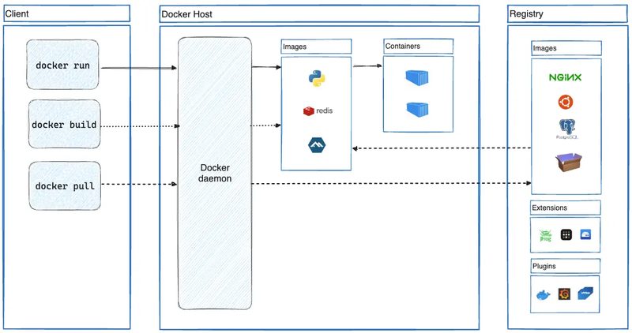

# Docker Workbook

## Docker Architecture

Docker uses a client-server architecture, consisting of several main components that work together to build, run, and manage containers. Here’s a breakdown of each part:

### Docker Client

The Docker Client is the primary way users interact with Docker. It sends commands to the Docker Daemon using CLI commands like `docker run`, `docker build`, `docker pull`, and `docker push`. The client communicates with the daemon through a REST API or command-line interface (CLI).

### Docker Host

This is the machine (local or cloud-based) where Docker Daemon runs, managing containers and images.

- **Images**: The Docker Daemon uses images to create containers. These images are built from Dockerfiles and can be pulled from the Docker Registry.
- **Containers**: Containers are instances of images that run applications. Containers are lightweight and isolated from each other but share the same OS kernel.

### Docker Daemon (dockerd)

The Docker Daemon runs on the Docker Host and manages all container-related tasks. It listens to API requests and handles actions like building, running, and distributing Docker containers. The daemon also manages Docker images and container lifecycle operations, ensuring efficient resource usage on the host machine.

### Docker Registry (Hub)

A Docker Registry is a repository where Docker images are stored and managed. Docker Hub is the default public registry, but private registries can also be set up. The registry allows users to push images to share with others or pull images for local use. Images are versioned and stored in the registry, serving as blueprints for creating containers on any Docker Host.

---

## Key Dockerfile Instructions

- `FROM <image>`: Set base image.
- `WORKDIR /app`: Set working directory.
- `COPY . .`: Copy all files to container.
- `RUN <command>`: Run commands in container.
- `EXPOSE <port>`: Expose container port.
- `ENTRYPOINT ["executable", "param"]`: Set container’s main executable.
- `CMD ["executable", "param"]`: Start container process.

---

## Working with Images

### Build, List, and Remove Images

- `docker build -t <image-name> .` - Build an image from a Dockerfile.
- `docker images` - List local images.
- `docker rmi <image-id>` - Remove an image by ID.
- `docker image prune -a` - Remove unused images.

### Pulling and Pushing Images

- `docker pull <image-name>` - Pull an image from a registry.
- `docker push <image-name>` - Push an image to a registry.

---

### Container Interaction and Inspection

- `docker exec -it <container-id> /bin/bash` - Start an interactive bash session in a running container.
- `docker inspect <container-id>` - Display detailed configuration and state info about a container.

---

### Container Lifecycle Management

#### Starting, Stopping and Managing Containers

- `docker run -d -p <host-port>:<container-port> <image>` - Start a container in detached mode with port mapping (e.g., 80:80).
- `docker stop <container-id>` - Gracefully stop a running container.
- `docker start <container-id>` - Start a stopped container.
- `docker restart <container-id>` - Restart a running or stopped container.
- `docker kill <container-id>` - Forcefully stop (kill) a running container.
- `docker rm <container-id>` - Remove a stopped container.
- `docker rm -f <container-id>` - Force remove a running container.
- `docker ps` - List running containers.
- `docker ps -a` - List all containers (including stopped).

#### Common Run Options

- `docker run --name <name> -it <image>` - Assign a custom name and run in interactive mode.
- `docker run -v <host-path>:<container-path> <image>` - Mount a volume from the host.
- `docker run --env <env-var>=<value> <image>` - Set an environment variable.
- `docker run --network <network-name> <image>` - Connect the container to a specified network.
- `docker run --rm <image>` - Automatically remove the container when it stops.

---

## Docker Compose Basic Commands

- `docker-compose up` - Start all containers
- `docker-compose down` - Stop and remove all containers
- `docker-compose logs` - View logs for all containers
- `docker-compose ps` - List running services

---
## Best Practices for Reducing Docker Image Sizes

1. Use smaller base images (e.g., alpine or distroless).
2. Minimize the number of layers by combining `RUN`, `COPY`, and other commands where possible.
3. Remove unnecessary files (e.g., documentation, build tools, temporary files) after installation.
4. Use multi-stage builds to separate build dependencies from the final image.
5. Use `.dockerignore` to exclude unnecessary files from the build context.
6. Install only required dependencies using minimal package managers or specific dependency tools.
7. Leverage caching effectively to avoid rebuilding unchanged layers.
8. Clear package caches and temporary files during installation (`apt-get clean`, `yum clean all`, etc.).
9. Pin specific versions of packages to ensure deterministic builds.

---

## Best Practices for Secure Docker Containers

1. Use trusted, minimal base images and scan them for vulnerabilities regularly.
2. Run containers as non-root users and drop unnecessary privileges (`--cap-drop`).
3. Limit resource usage with CPU, memory, and network constraints.
4. Secure sensitive data using environment variables and secrets managers.
5. Restrict container-to-host access by avoiding `--privileged` mode and unnecessary host mounts.
6. Monitor container activity and implement logging for anomaly detection.
7. Keep Docker, images, and the host OS updated to patch vulnerabilities.
